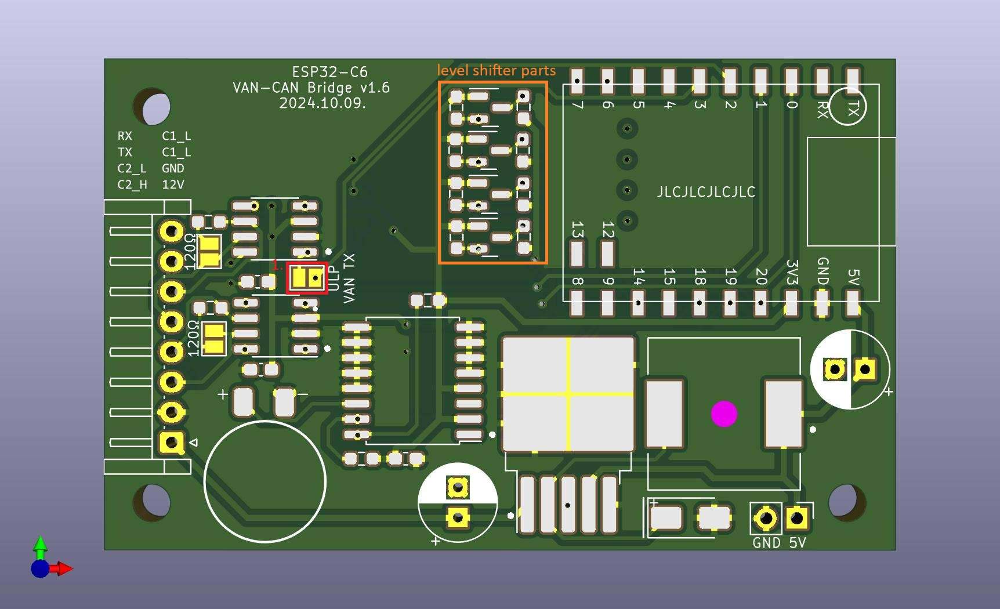

# PSA VAN-CAN protocol bridge (hardware)

### What is it ?
This is the hardware needed for my [PSA CAN protocol bridge][psacanbridge] and [PSA VAN-CAN protocol bridge][psavancanbridge] software (v3 branch).

It was designed using KiCad 7.0.6 as a standalone board with an ESP32-C6 SuperMini soldered in place. The CAN transceiver used on this board is the TJA1050 (note: the schematic shows a TJA1042, but the two are interchangeable).

### v1.6

:warning: **IF YOU ARE USING THE BOARD AS A VAN-CAN BOARD THEN BE AWARE THAT THE VAN DATA LINES HAVE BEEN SWAPPED IN THIS VERSION COMPARED TO THE BOARDS BEFORE v1.5. DATA LINE IS ON PIN 6 AND DATAB LINE IS ON PIN 5. ON EARLIER BOARDS IT WAS THE OTHER WAY AROUND. IF UPGRADING FROM A VERSION PRIOR TO v1.5. MAKE SURE TO SWAP THESE WIRES ON YOUR PATCH LEAD**

This won’t damage the board or your car, but it simply won’t work unless the wires are swapped.

#### VAN-CAN bridge

To use the board as a VAN-CAN bridge, simply close the jumper marked with a red rectangle on the front (1). Additionally, close the jumper marked with a red rectangle on the back (2) of the board to 3V3 so the CAN transceiver uses 3.3V logic levels.

#### CAN-CAN bridge

To use the board as a CAN-CAN bridge, follow the same steps: close the jumper marked with a red rectangle on the front (1), and the one on the back (2) to 3V3 for 3.3V logic levels on the CAN transceiver.

#### SPI shield on the back

The board includes a footprint for [my SPI shield][vancanspishield] on the back, but the shield is not necessary. It’s intended only as a fallback mechanism. Because of this, you don't need the level shifter circuit on the front (marked with an orange rectangle), so it can be omitted.

However, **if you choose to use the SPI shield**, the jumper on the back (2) must be closed to 5V, and the level shifter circuit **is** required in that case. Also the jumper marked with a red rectangle on the front (1) must not be connected in this case.

### Programming the board

The board can be programmed using the ESP32-C6 SuperMini's USB-C port.

💡 **Do not connect USB and 12V to the board at the same time.**

### Schema

### PCB

### Assembly

The board was designed to be as compact as possible. I recommend sending the manufacturing files to JLCPCB and ordering their assembly service. However, some manual soldering is still required. The necessary components are listed in the next section.

💡 **Soldering jumpers JP1 and JP2 enables the CAN termination resistors (not needed for PSA vehicles).**

ESP32-C6 SuperMini

I bought a [DS3231 real time clock module for Raspberry Pi][DS3231] disassembled it and placed its parts to J1 and U2.

The board dimensions were designed to fit a [70 x 45 x 18mm case][enclosure].

### BOM

Only components not populated by the assembly company are listed below:

|Designator|Value         |Package                                         |
|----------|------------|------------------------------------------------|
|U1        |ESP32-C6 SuperMini      |     |
|J1        |Coin battery for DS3231      |     |
|U2        |DS3231      |SOIC-16W_7.5x10.3mm_P1.27mm     |
|C7        |100uF       |Capacitor_THT:CP_Radial_D6.3mm_P2.50mm     |
|C8        |220uF       |Capacitor_THT:CP_Radial_D6.3mm_P2.50mm     |

The connector for the power and signal wires is a JST-XH6 2.54 mm

The full BOM is available in the production folder as a CSV file.

[vancanspishield]: https://github.com/morcibacsi/VanCanSpiShield
[psacanbridge]: https://github.com/morcibacsi/PSACANBridge
[psavancanbridge]: https://github.com/morcibacsi/PSAVANCANBridge
[DS3231]: https://www.aliexpress.com/item/1005006116699524.html
[enclosure]: https://www.aliexpress.com/item/1005005467281776.html